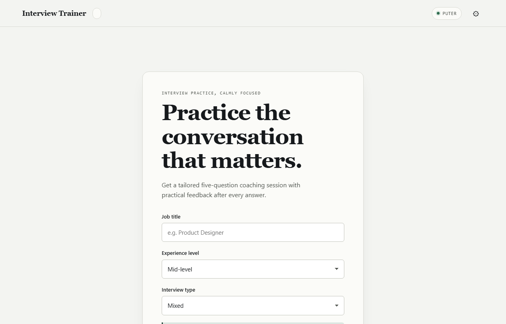

# Gahez

**Interview practice that adapts to you.**

Pick a role. Answer five questions, one at a time. Get scored, specific feedback after each one — not generic encouragement.

[**Try it live →**](https://gahez-zeta.vercel.app/)

---

## What it does

- 🎯 **Questions tailored to your role** — PM, design, frontend, sales, marketing, ops, finance, HR, and more, each with its own question bank pulled from real day-to-day work rather than generic STAR prompts.
- 🧠 **Feedback you can act on** — every answer is scored across five categories (relevance, clarity, structure, specificity, confidence), paired with a worked example answer and the follow-up questions an interviewer would likely ask next.
- 🔑 **No account required** — Puter powers the AI by default at no cost to you. Prefer a different model? Add your own Anthropic, OpenAI, or Gemini key in Settings.
- 🔒 **Nothing leaves your browser that doesn't have to** — no backend, no analytics, no tracking scripts. Any key you add stays in the browser and is sent only to the provider you chose.
- 📱 **Built for whatever screen you're on** — the layout adjusts across phone, tablet, and desktop, touch targets are sized for fingers rather than cursors, and `Ctrl+Enter` submits an answer from the keyboard.

## Bring your own key

Puter needs no setup and works out of the box. Want a different model? Click the gear icon, pick a provider, paste in a key. "Remember on this device" is off by default — leave it that way and the key only lives for the current tab.

## Mock mode

Add `?mock=1` to the URL to try the interface with canned responses instead of live AI calls — a quick look around without touching your API usage.

## Architecture

A static site, four scripts, no build step:

| File | Role |
|---|---|
| `index.html` | UI markup, screen templates, dialogs |
| `css/styles.css` | design tokens, themes, responsive layout |
| `js/storage.js` | `localStorage` (provider, theme) and `sessionStorage` (key, draft answer) |
| `js/ai.js` | provider routing, prompt construction, response parsing |
| `js/interview.js` | session state, scoring, summary |
| `js/app.js` | rendering, screen routing, dialogs, event handling |

Each file exposes one namespace — `InterviewStorage`, `InterviewAI`, `InterviewSession`, `InterviewApp` — and only `ai.js` knows an AI provider exists. Session logic and the UI layer never touch a raw provider response.

The project carries an automated test suite covering storage, settings validation, session lifecycle, and response parsing, plus lint checks on every script.

## Security posture

This is a static, no-backend app, so the relevant question is what a malicious page or compromised browser extension could do on this origin.

- 🛡️ **Strict CSP** — no inline scripts, no third-party scripts beyond the Puter SDK, no `eval` or `document.write`.
- 🔐 **API keys** stay in `sessionStorage` unless you explicitly opt into `localStorage`, and are never sent anywhere but the provider you selected.
- 🧩 **Prompt-injection handling** — job titles, questions, and answers are wrapped in delimiters that tell the model to treat them as data, not instructions.
- 🚫 **No `innerHTML` writes of user or AI-generated text** — everything is rendered through `textContent` or built as DOM nodes directly, which rules out script injection through a malformed response.
- 🕵️ **Referrer-Policy** set to `strict-origin-when-cross-origin`, so your prompt text isn't leaked to providers through the `Referer` header.
- 🎛️ **Permissions-Policy** denies camera, microphone, geolocation, and everything else the app has no use for.
- No trackers, no analytics, no cookies.

What this doesn't cover: a compromised browser extension running on the same origin, a compromised device, or a phishing page that convinces you to paste your key somewhere else. A key you choose to persist is only as safe as the browser and device it's stored on.

## Adding a new role

Open `js/ai.js`, find `roleKeywords`, and add an entry there. Then add a matching set of three to five `(topic, question)` pairs under `roleBank`. Nothing else needs to change.

---

MIT — see [LICENSE](LICENSE)

